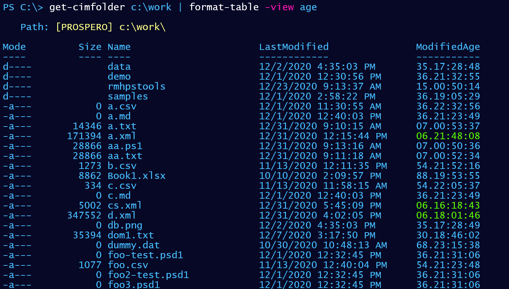
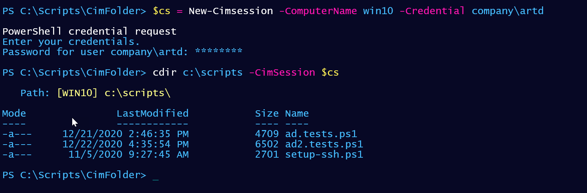
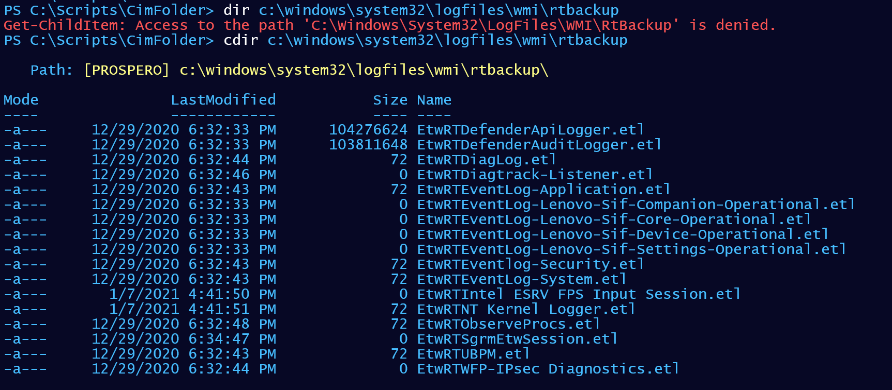

# CimFolder

This module uses CIM classes to retrieve files and directories from the local computer or a remote computer by name or using a CIMSession. It only has a single command, `Get-CimFolder` with an alias of `cdir`. The module includes [help documentation](docs/Get-CimFolder.md) for the command. The module includes a [custom formatting file](formats/cimfilefolder.format.ps1xml) with several defined views.

This module is a sample solution for an [Iron Scripter challenge](https://ironscripter.us/a-cim-ple-powershell-challenge/) and should be considered a work in progress or proof-of-concept. This __is not__ the only, or definitive solution to the challenge.

The module will only work on PowerShell 7.x on Windows platforms, although it could be rewritten to work in Windows PowerShell.

## Sample Usage

Here are a few examples of the module in action.

||
|:--:|
|_Get a folder listing with colored highlights_|

The current version of the command lacks filtering capabilities. But the module includes an additional custom table view.

||
|:--:|
|_Using a custom view_|

You can query a remote computer by its name, or create a CIM Session.

||
|:--:|
|_Using a CIMSession_|

As an interesting side note, using the CIM cmdlets appear to circumvent access-control. At least, enough to get a listing.

||
|:--:|
|_Avoiding Access Denied_|

## Next Steps

The module has room for improvement if you'd like a challenge.

+ Add parameters to display only directories or files.
+ Don't display hidden files and folders by default.
+ Add a `-Force` parameter to display hidden files and folders.
+ Add a color display for 0-byte files.
+ Add a color display based file extension.
+ Add filtering options for file names.
+ Add better error handling if the path on the remote computer doesn't exist.
+ Add an `-Asjob` parameter to run as a background job.
+ Improve performance for a large number of subfolders by using `Foreach-Object -parallel`.

There are no plans to publish this module to the PowerShell Gallery as it is not a production-ready tool.

last updated _2021-01-07 23:09:56Z_
