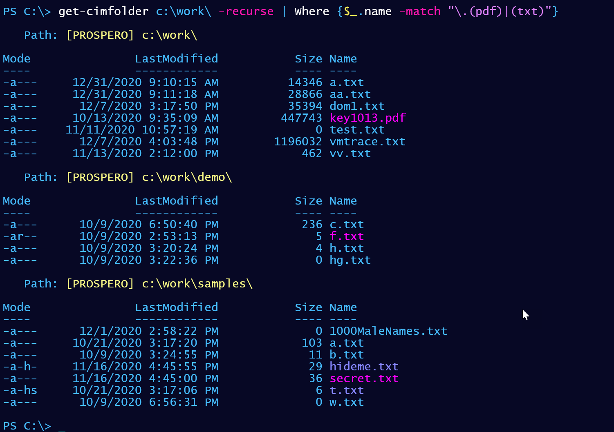

# CimFolder

This module uses CIM classes to retrieve files and directories from the local computer. It only has a single command, `Get-CimFolder` with an alias of `cdir`. The module includes a custom formatting file.

The module is a sample solution for an [Iron Scripter challenge](https://ironscripter.us/a-cim-ple-powershell-challenge/) and should be considered a work in progress.

The module has room for improvement if you'd like a challenge.

+ Add parameters to display directories or files only.
+ Don't display hidden files and folders by default.
+ Add a `-Force` parameter to display hidden files and folders.
+ Add a color display for 0-byte files.
+ Add filtering options for file names.

The module will only work on PowerShell 7.x on Windows platforms, although it could be rewritten to work in Windows PowerShell.

last updated _2020-12-03 15:28:56Z_
